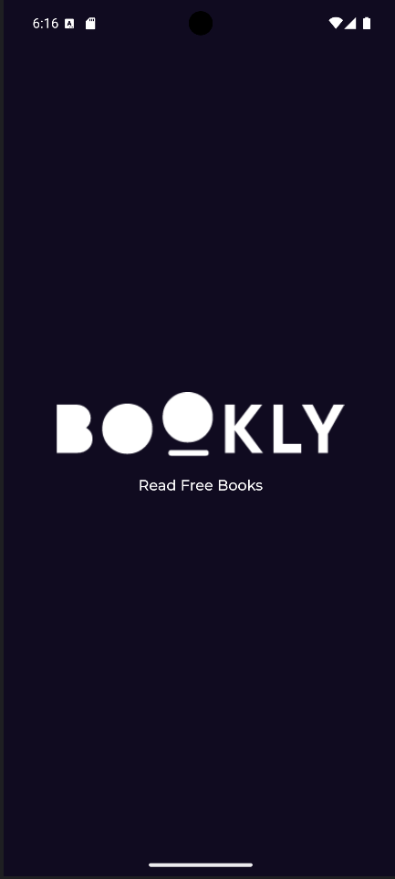
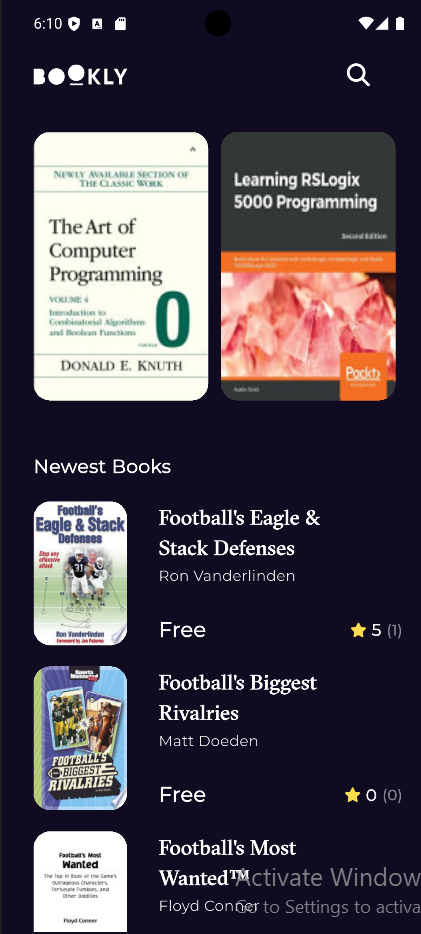
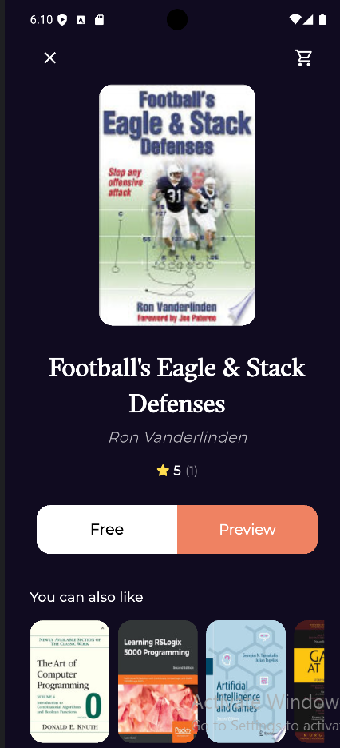

# Bookly App 📚

A professional, high-performance Flutter application for browsing and searching books using the **Google Books API**. Built with a modular approach, focusing on **Clean Architecture**, **MVVM**, and a seamless User Experience.

## ✨ Features
- **Home Screen**: Explore featured book collections and the latest releases.
- **Real-time Search**: Instant search functionality to find any book in the Google database.
- **Book Details**: Comprehensive view of book metadata including ratings, authors, and descriptions.
- **Direct Access**: Integrated **url_launcher** to preview or purchase books directly via the browser.
- **Enhanced UX**: Custom-built **SnackBars** for polished user notifications and error reporting.

## 🏗️ Architecture & Design Patterns
The app is structured to be scalable and testable:
- **Repository Pattern**: Abstracted data layer with `HomeRepo` and `HomeRepoImpl`.
- **MVVM Pattern**: Clear separation between UI (Views) and Business Logic (Cubits).
- **Dependency Injection**: Decoupled components for easier maintenance and testing.
- **Declarative Routing**: Managed using **GoRouter** for efficient and deep-link-friendly navigation.
- **Modular UI Components**: UI is broken down into small, reusable widgets (e.g., separating ListViews from their Items) to improve code readability and optimize widget rebuilds.

## 🛠️ Tech Stack & Tools
- **Framework**: Flutter (Material 3).
- **State Management**: **Cubit (Bloc)** for reactive and predictable state flow.
- **Networking**: **Dio** with advanced API integration.
- **Error Handling**: Centralized `Failures` class to intercept and categorize **DioExceptions**, mapping API status codes to user-friendly messages.
- **Data Parsing**: Robust handling of API null values and inconsistent data types.
- **Design System**: A centralized `Styles` class for consistent typography and UI scaling across the app.

## 📸 Screenshots

  
  
  
  

